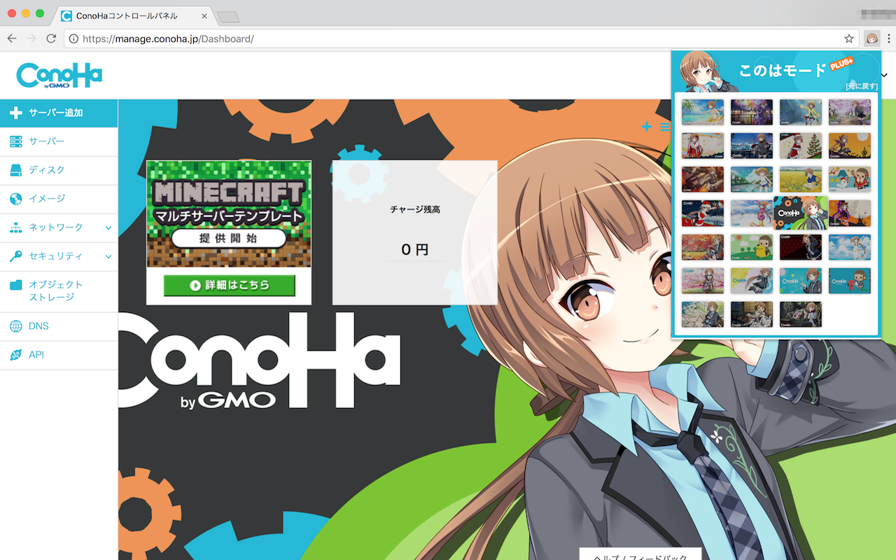

# このはモードPLUS!

VPSサービス[ConoHa](https://www.conoha.jp/)のコントロールパネルの背景を変更することができるプラグインです。 

## インストール

[Chromeウェブストア](https://chrome.google.com/webstore/detail/%E3%81%93%E3%81%AE%E3%81%AF%E3%83%A2%E3%83%BC%E3%83%89plus/nehkcogkidnjgldmgpijfajajnhokipe)からインストールしてください。

## 使い方

ConoHaのアカウントが必要になります。[コントロールパネル](https://www.conoha.jp/conoha/login)からログインした後、「アカウント設定」->「モード設定」を「このはモード」に変更すると、このはモードPLUS!が有効になります。

## LICENSE

MIT
